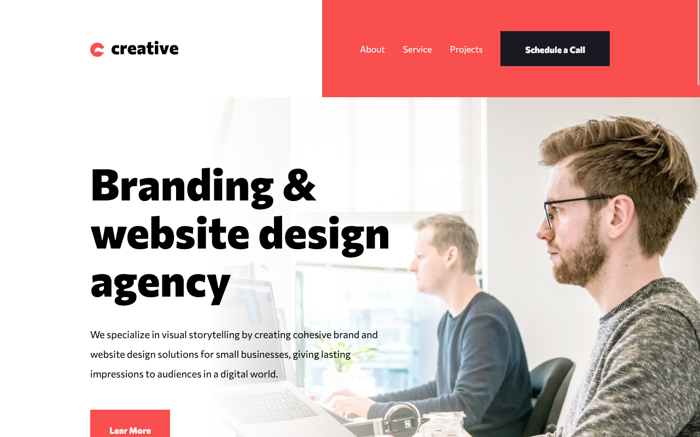

# Frontend Mentor - Creative agency single page site solution

This is a solution to the [Creative agency single page site challenge on Frontend Mentor](https://www.frontendmentor.io/challenges/creative-agency-singlepage-site-Pq6V3I2RM). Frontend Mentor challenges help you improve your coding skills by building realistic projects.

## Table of contents

- [Overview](#overview)
  - [The challenge](#the-challenge)
  - [Screenshot](#screenshot)
  - [Links](#links)
- [My process](#my-process)
  - [Built with](#built-with)
  - [Useful resources](#useful-resources)
- [Author](#author)

**Note: Delete this note and update the table of contents based on what sections you keep.**

## Overview

### The challenge

Users should be able to:

- View the optimal layout for the site depending on their device's screen size
- See hover states for all interactive elements on the page
- Navigate the slider using either their mouse/trackpad or keyboard

### Screenshot

### Links

- Solution URL: [Github repository](https://github.com/aroquega/creative-agency)
- Live Site URL: [Github page](https://github.com/aroquega/creative-agency)

## My process

### Built with

- Semantic HTML5 markup
- Flexbox
- Mobile-first workflow
- [React](https://reactjs.org/) - JS library
- [Tailwindcss](https://tailwindcss.com/) - For styles

### Useful resources

- [The picture element](https://web.dev/learn/design/picture-element) - This helped understand the picture element.
- [Bold on hover](https://css-tricks.com/bold-on-hover-without-the-layout-shift/) - This article helped me solve font bold on hover problem.

## Author

- Website - [aroquega](https://aroquega.com/)
- Frontend Mentor - [@aroquega](https://www.frontendmentor.io/profile/aroquega)
